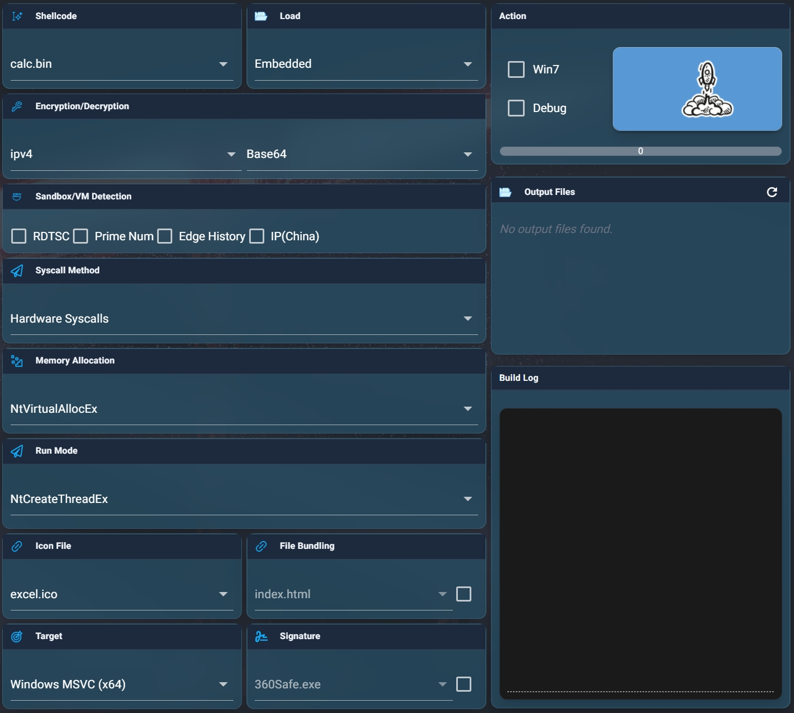
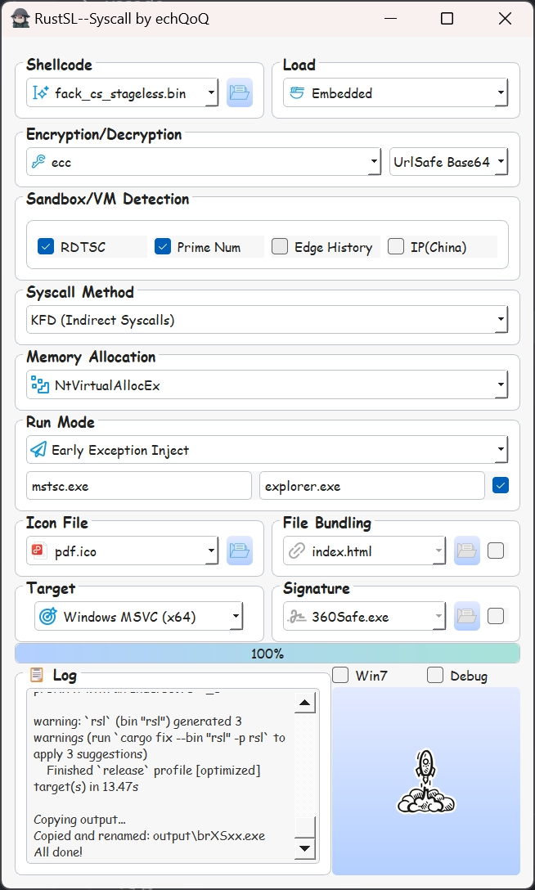

# RustSL —— syscall

### 项目概述
RSL-SYSCALL 是 [RustSL](https://github.com/echQoQ/RustSL)的 syscall 版本，专注于使用间接系统调用、无线程注入、PPID伪造等多种先进的免杀技术相互结合实现 shellcode 加载和执行。

---

### **免责声明**：

- 本项目尚不成熟，也不保证兼容性、稳定性以及免杀性，仅供教育和研究目的使用，所以请尽量不要以被XXX检测到为由提交ISSUE。项目兼容性也有限，如有问题请自行排查。
- 使用者应确保其行为符合当地法律法规,作者不对任何非法使用或由此产生的后果承担责任。
- 请在受控环境中测试和使用。

---

### 使用方法

环境配置参见[原RustSL 文档](https://github.com/echQoQ/RustSL)
与之类似，除GUI外，新增了 web 界面
配置完环境后，运行以下命令启动对应界面：
- web:
```
pip install -r web/requirements.txt
python web.py
```



- gui:
```
pip install -r gui/requirements.txt
python gui.py
```



---

### 核心技术与功能

懒得写

---

## 致谢

特别感谢以下开源项目和技术贡献者：

- [SysWhispers](https://github.com/jthuraisamy/SysWhispers)
- [Hell's Gate](https://github.com/am0nsec/HellsGate)
- [Tartarus' Gate](https://github.com/trickster0/TartarusGate)
- [EarlyExceptionHandling](https://github.com/kr0tt/EarlyExceptionHandling)
- [HWSyscalls](https://github.com/Dec0ne/HWSyscalls)
- [rust-mordor-rs](https://github.com/gmh5225/rust-mordor-rs)
- [earlycascade-injection](https://github.com/Whitecat18/earlycascade-injection)
- [SilentMoonwalk](https://github.com/klezVirus/SilentMoonwalk)
- [Unwinder](https://github.com/Kudaes/Unwinder)
- 等等

### 许可证

本项目采用 MIT 许可证，详情请参阅 LICENSE 文件。